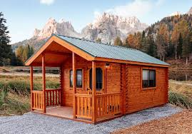

# Smart Cabin pricing

Final project for the Building AI course

## Summary

This project uses machine learning to predict cabin prices based on features such as size, sauna, distance to water, number of bathrooms, and proximity of neighbors. It demonstrates data preprocessing, model training, and evaluation with clear reproducible code. 


## Background

People looking to buy or sell cabins often struggle to estimate a fair market price.
Real estate pricing can be inconsistent due to subjective valuation and lack of transparent data-driven tools.
Over- or underpricing leads to financial losses and slower sales.
Automated price prediction makes the process faster and more objective.
Personal motivation: I enjoy applying machine learning to practical problems. Cabin pricing is a relatable example where data-driven predictions can make a real difference.
Importance: Accurate, explainable AI for property valuation can benefit both buyers and sellers, reduce uncertainty, and demonstrate how machine learning models can be used for decision support in everyday life.

## How is it used?

Collect cabin data (size, sauna, distance to water, bathrooms, neighbors).
Train the machine learning model with the provided scripts or notebooks.
Save the trained model for reuse.
Run the prediction script with new input values to estimate the cabin price.
Optionally, extend the project with more features or connect it to a simple web app for interactive use.





```
def main():
    # cabin features: [size, sauna_size, dist_to_water, bathrooms, neighbors]
    cabins = [
        ("Cabin A", [25, 2, 50, 1, 500]),
        ("Cabin B", [82, 5, 20, 2, 120]),
        ("Cabin C", [130, 6, 10, 2, 600])
    ]
    prices = [127900, 268000, 460700]   # known market prices

    # predict price using a simple linear formula (toy example)
    coeffs = [3000, 200, -50, 5000, 100]  # coefficients per feature

    for (name, features), price in zip(cabins, prices):
        predicted = sum(f * c for f, c in zip(features, coeffs))
        print(f"{name}: actual {price} €, predicted {predicted:.0f} €")

main()

```


## Data sources and AI methods

When dataset used in this project isbased on publicly available statistics and synthetic examples for demonstration purposes. I did not collect the data myself; it is inspired by open sources such as:
OECD Data
Statistics Finland
No private or sensitive information is used. All data included here is simplified for educational purposes.
Source	Description	License / Access
OECD Data	Economic and social statistics across OECD	Public / Open
Statistics Finland	Official Finnish statistical data	Public / Open
## Challenges

The project does not guarantee exact market prices; it only provides estimates.
Real estate prices are influenced by many external factors (location, economy, seasonality) that may not be included in the model.
Ethical considerations: relying on AI for pricing could create biases or give unfair advantages if the model is trained on incomplete or biased data.
Limitations: the model’s accuracy depends heavily on the quality and representativeness of the data.

## What next?

Add larger and more diverse datasets to improve accuracy.
Develop a simple web app or API so others can use the model easily.


## Acknowledgments

Thanks to open data providers such as OECD Data and Statistics Finland for inspiration and reference values.
This project is inspired by examples from online machine learning courses and documentation.
Do not use code, images, data, or other materials from others without permission.
